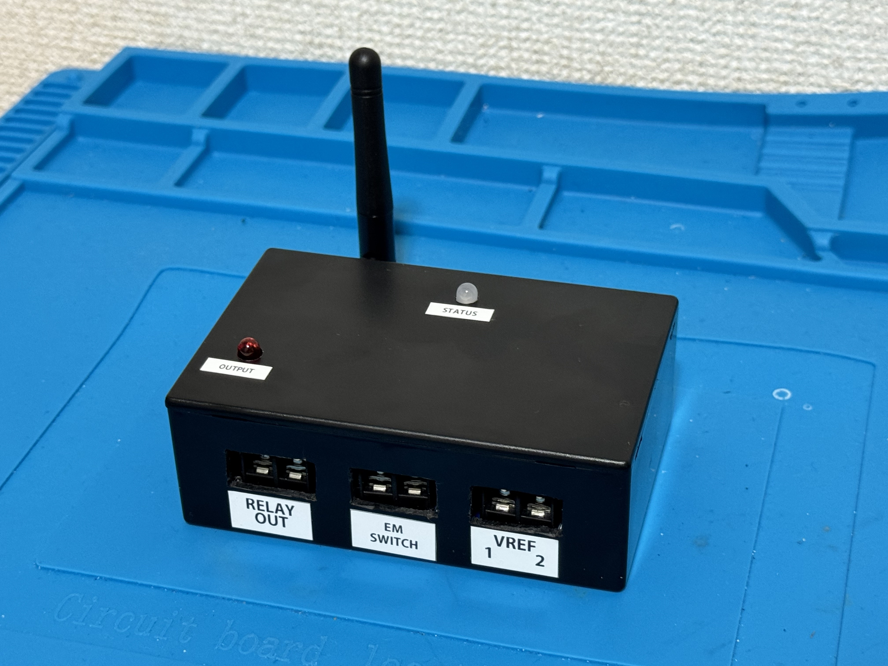

# PowerBoard2025
外部リレーを駆動する、リレーコントロールユニットの公開データです。

 

[専用ワイヤレススイッチ](https://github.com/KimuraTomohiro/PowerBoard2025)でリレーの緊急遮断制御ができるリレーコントロールユニットです。
本体は[こちらのBoothページ](https://kimuratomohiro.booth.pm/)で販売予定です。
仕様に関する質問は`runs_augury7u[Atto]icloud.com`までお願いします。(かっこを＠に置き換えてください)

## 特徴
リレーを外付けとすることで本体を小型化するとともに、汎用性を向上しました。  
用途に応じ、リレーを選定して接続するだけで使用できます。  
入力可能電圧範囲が5-28Vと広く、DCDCコンバータと組み合わせることで最大48Vの電源を制御することができます。  
各種保護機能を搭載し、モーター直結のようなサージのかかる電源でも安定して使用できます。  
リレーの遮断は物理ボタン、Arduino互換ボード、ワイヤレススイッチの任意の方法で行うことができ、使用しない場合は無効化することも可能です。  
出力制御の取りまとめはマイコン内部ではなく信頼性の高いロジックICで行っています。  
0.05V刻みで電圧を測定する機能があり、基準電圧を設定すれば電圧が基準値以下となった際にブザーで警告することも可能です。

## 定格表
| 項目 | 最小 | 最大 |
|-----|-----|-----|
|INPUT端子入力電圧(V)|5.0|28.0|
|RELAY端子出力電流(A)|/|5.0|
|VREF端子入力電圧(V)|/|48.0|
|VREF端子測定可能電圧(V)|/|44.1|
|VREF端子分解能(V)|0.044|/|

## 保護機能
全ての入力端子にTVSダイオードを設け、過電圧やサージによるデバイスの故障を防ぎます。  
PCと接続するSeeeduno Xiaoと制御用マイコンの間は絶縁されており、万が一デバイスが故障する過電圧がかかった際でもPCへの影響はありません。  
3つある保護機能はロジックICのAND回路で構成されているため、マイコンが故障した際でも他の停止機能は影響を受けません。  

## 各部名称
正面  
 

側面  
 

背面  
 

ユニット内部  
 

### 各部の役割
* ユニット電源入力端子  
デバイスの電源を供給します。  
リレーの駆動はここに入力された電圧を直接使用するため、リレーのコイル電圧とあった電圧を入力してください。  
入力可能電圧範囲は、5Vから28Vです。

* ステータスランプ  
[ワイヤレススイッチ](https://github.com/KimuraTomohiro/Wireless_EM_Switch)との通信状況を表示します。

* アンテナ  
TWELITEの通信に必要なアンテナです。[アンテナケーブルMW-C-PJ-2M-1](https://mono-wireless.com/jp/products/TWE-ANTENNAS/cables/index.html)を間に挟むことで、延長することも可能です。   
ユニットが金属筐体に囲まれる場合、筐体外に外付けのアンテナを露出しないと通信の信頼性が低下します。   
逆にユニット自体が露出する場合、[薄型アンテナ](https://mono-wireless.com/jp/products/TWE-ANTENNAS/pcb/index.html)をユニット内部に貼り付けて使用することでユニット外にアンテナを露出させず、よりコンパクトに収めることもできます。

* リレー接続端子  
外付けのリレーを接続します。

* 外部スイッチ接続端子  
外付けの緊急停止スイッチを接続することで、そのスイッチでも緊急停止動作が可能になります。外付けするボタンはNC動作のものを使用してください。

* 測定電圧入力端子  
入力された電圧を測定し、ワイヤレススイッチに表示することができます。  
電圧が基準値以下となった際にブザーで知らせる機能もあります。  
2系統ある入力にそれぞれ異なる基準値を設定することが可能です。  
測定可能な電圧の範囲は0Vから44Vまでです。  
バッテリーの過放電保護に活用できます。  
ユニット電源のマイナス端子が測定の基準電位となります。  
ユニット電源と測定電圧入力端子の基準電位が接続されない、絶縁型のDCDCコンバータを使用している場合や、GNDが独立した電源は正しく測定できません。

* 出力ランプ  
リレー接続端子に電圧が出力されている際に点灯します。

* Seeeduno Xiao  
Arduinoの互換ボードであるSeeeduno Xiaoで、緊急停止動作が可能です。またシリアル通信を通して電圧と出力状況を確認することができます。

* 制御機能無効化スイッチ   
本機に搭載されている3種類の緊急停止機能、
1. 物理スイッチを使ったハードウェア緊急停止機能
2. Seeeduino Xiaoを使ったソフトウェア緊急停止機能
3. TWELITEを使ったワイヤレス緊急停止機能  
を機能ごとに無効化することができます。  
スイッチを`ON`側にすると、その制御機能は無効化されます。   
機能が不要な場合や、一時的な試験で電源を取りたい時に簡単に切り替えることができます。

## 接続例について
接続例とそれぞれの接続例の注意事項は[こちら](接続例.md)をご確認ください。

## ステータスランプについて
ステータスランプは、現在の状況に応じて色と光り方が変化します。
* 色  
赤色: ワイヤレススイッチとの通信が確立できていない  
緑色: ワイヤレススイッチとの通信が確立できている  

* 光り方  
点灯: 通常状態  
点滅: 緊急停止状態  
早い点滅: 緊急停止解除動作中

## 複数台の併用利用について
本機はネットワーク上、無線の親機としての役割を果たすため、複数台併用することは想定していません。そのため複数のロボットを一つのリモコンで同時に制御するといった方法は現状対応できていません。  
一つのユニットに複数のリレーを接続することは可能です。[接続例2以降](接続例.md#接続例2-2系統の接続)を参照してください。

## プログラムの書き換えについて
チャンネルIDやアプリケーションIDの変更には[TWELITER3](https://mono-wireless.com/jp/products/twelite-r/index.html)が必要です。
詳しくは[プログラム書き換え方法](プログラムの書き換えについて.md)を参照してください。

## アプリケーションIDとチャンネルの確認方法について
リレーコントロールユニットと通信を行うためには、本機のアプリケーションIDとチャンネルIDが一致している必要があります。
本機のアプリケーションIDとチャンネルIDは、本機の裏蓋にシールで記載します。　　　
追加でワイヤレススイッチが必要な場合は、そちらを併せてご連絡ください。
