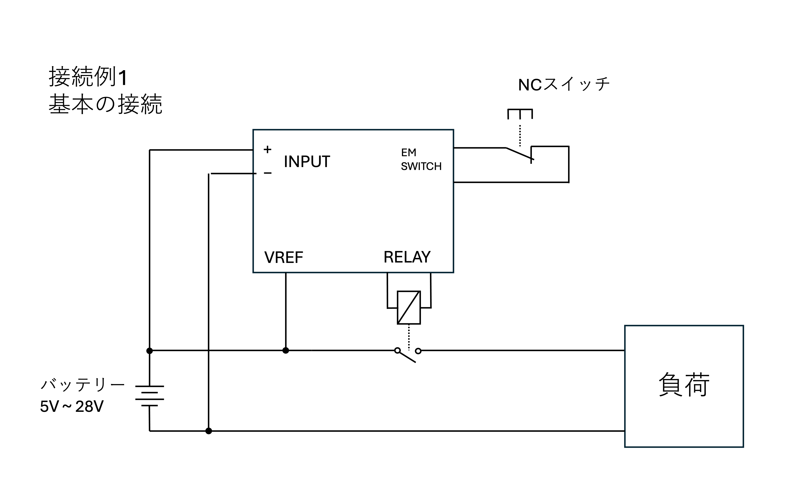
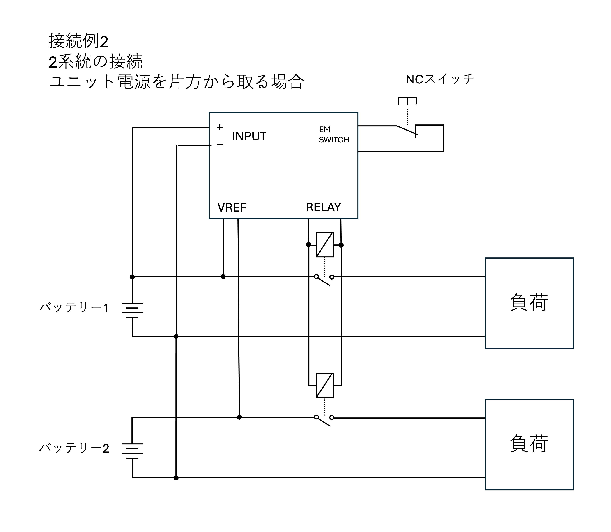
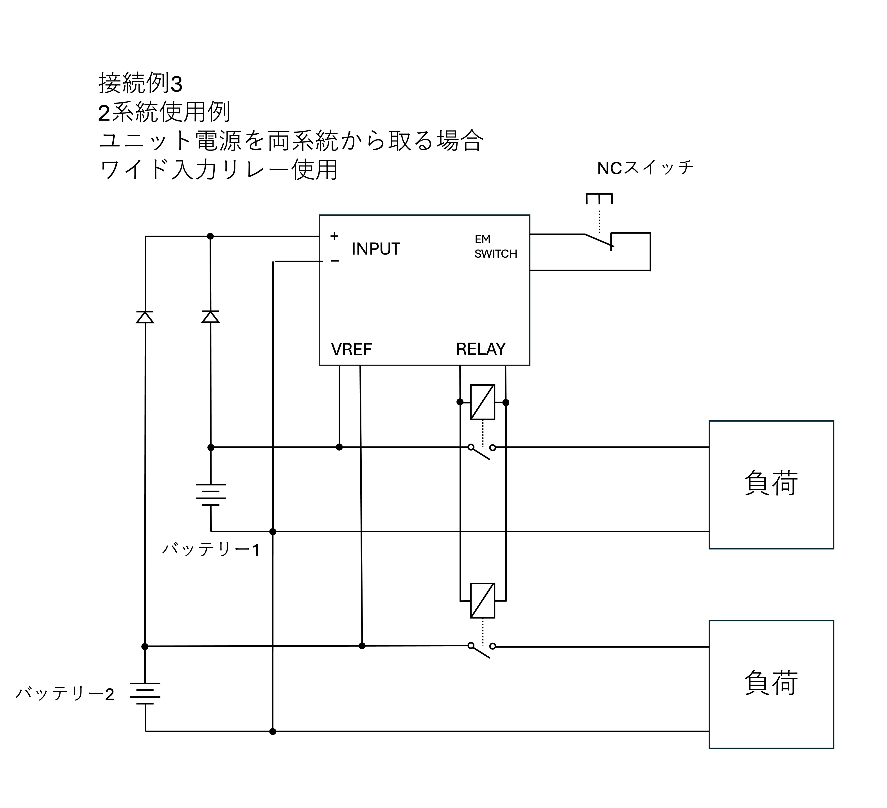
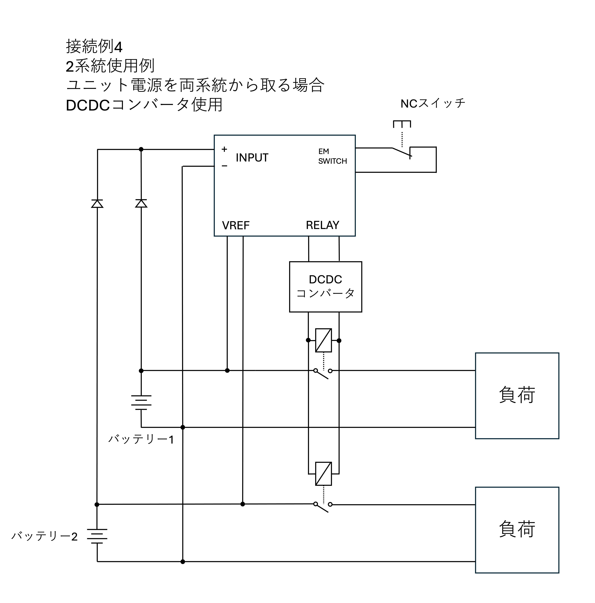
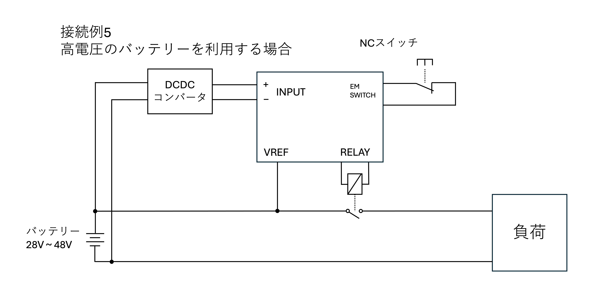

# 接続例
ここでは、本ユニットの接続例と、各接続例における注意事項を記載します。

## 接続例1: 基本の接続
 
基本となる、一系統の接続例です。  
RELAY端子には出力時、INPUTと同じ電圧が印加されるため、INPUT電圧に合わせたリレーを選定してください。  
一般的な12,24V系統でモーターなどの大電流を必要とする機器を駆動する場合、自動車用のスターターリレーなどが安価に大電流を制御できるためおすすめです。

## 接続例2: 2系統の接続
 
2系統を2つのリレーで制御制御する際の接続例です。  
VREFはINPUTのマイナス端子を基準として電圧を測定するため、2系統のGNDは共通である必要があります。  
この方法はシンプルですが、バッテリー2のみではユニットを駆動することができないというデメリットがあります。  
どちらか片方のバッテリーだけでもユニットを起動したい場合は、[接続例3以降](#接続例3-2系統の接続-2-ワイド入力リレーを使用する)を参照してください。

## 接続例3: 2系統の接続② ワイド入力リレーを使用する
 
外付けダイオードを介して、ユニットに電源を供給します。  
接続されるバッテリーによってリレー電圧が変化するため、どちらのバッテリー電圧でも駆動可能なワイド入力リレーを使用してください。  
ワイド入力リレーの選定が難しい場合は、[接続例4](#接続例4-2系統の接続-dcdcコンバータを使用する)を参照してください。

## 接続例4: 2系統の接続③ DCDCコンバータを使用する
 
接続例3のリレー駆動電源をDCDCコンバータを使用して変圧する例です。

## 接続例5: 高電圧のバッテリを使用する場合
 
バッテリ電圧が28Vより高い場合、DCDCコンバータで降圧することでユニットの駆動が可能です。  
VREF端子は48Vまでの入力に対応していますが、測定可能範囲は44.1Vです。
